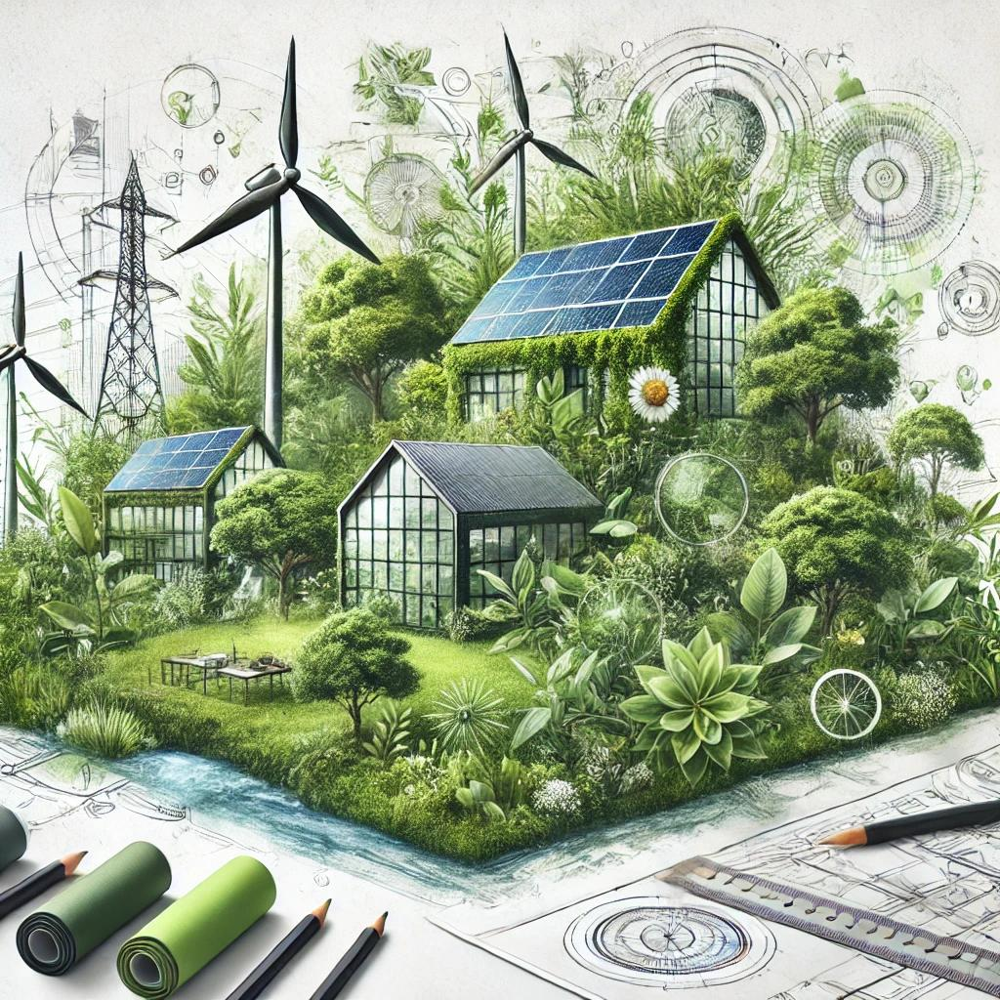

# El ecodiseño y las estrategias sostenibles

Este concepto nos permite no solo reducir el daño que causamos al planeta, sino también crear una economía más circular y sostenible. Esta filosofía va más allá de reciclar, se trata de una visión que considera todos los aspectos medioambientales en cada paso del ciclo de vida de un producto.

**· Se basa en;**

-Reducir la generación de residuos 
-Evitar la contaminación
-Innovación y mejora continua
-Consideración de todos los actores 
-Precaución y prevención

## Pasos para implemnentar el ecodiseño

**- Compromiso gerencial:** que todos estén de acuerdo en implementarse (las empresas y demas...).
**- Formación del equipo de trabajo.**
**- Análisis del ciclo de vida del producto** (hablado en el punto 1.5).
**- Implementación y monitoreo:** verificamos su efectividad y realizar los ajustes necesarios.

Al elegir productos y servicios ecodiseñados, los consumidores están incentivando a las empresas a seguir este camino. Por eso, como consumidores, debemos estar informados y optar por productos que contribuyen a un futuro sostenible. 

