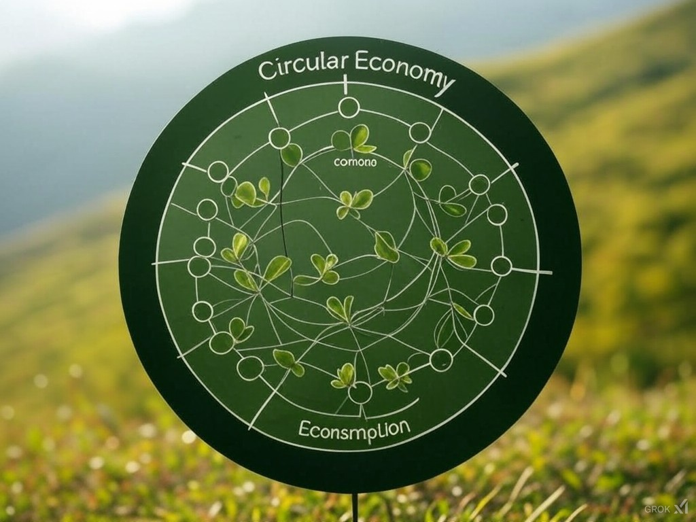
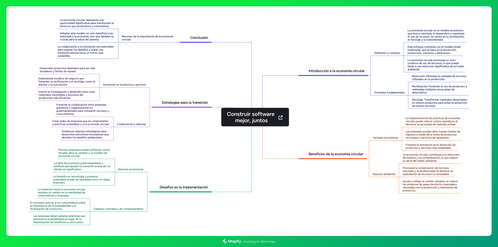

# LA ECONOMÍA CIRCULAR

---
Imagen Realizada Con [Grok (Inteligencia Artificial de Twitter)](https://x.ai/)
## Índice
1.1. [Introducción](introduccion.md)

1.2 [Concepto de economía circular](concepto.md)

1.3 [Modelos de producción actuales y consumismo](modelos.md)

1.4 [La economía verde](verde.md)

1.5 [Ciclo de vida de un producto](CicloProducto.md)

1.6 [El ecodiseño y las estrategias sostenibles](ecodiseño.md)

## Mapa conceptual

Herramienta Utilizada: [Mapify](https://mapify.so/es)
## Glosario

### 1.1 Introducción  
La economía circular es un modelo sostenible que busca optimizar el uso de los recursos, reduciendo residuos y promoviendo la reutilización, el reciclaje y el ecodiseño. Su objetivo es minimizar el impacto ambiental y fomentar un sistema más eficiente y respetuoso con el planeta.

### 1.2 Concepto de economía circular  
Modelo económico que busca optimizar el uso de los recursos al máximo, minimizando la generación de residuos. Se basa en reducir, reutilizar y reciclar, fomentando un sistema sostenible en el que los productos y materiales mantengan su utilidad durante el mayor tiempo posible.

### 1.3 Modelos de producción actuales y consumismo  
Los modelos de producción actuales suelen ser lineales, es decir, extraen recursos, producen bienes y generan desechos. El consumismo se refiere a la tendencia social que promueve el consumo excesivo de bienes y servicios, a menudo con un impacto negativo en el medio ambiente.

### 1.4 La economía verde  
Enfoque económico que busca el desarrollo sostenible mediante la reducción de riesgos ambientales y la mejora del bienestar humano. Se enfoca en actividades que favorezcan la sostenibilidad ecológica, como la energía renovable y la protección de los recursos naturales.

### 1.5 Ciclo de vida de un producto  
Conjunto de etapas por las que pasa un producto desde la extracción de los recursos necesarios para su fabricación, su producción, distribución, uso y hasta su disposición final. El análisis del ciclo de vida (ACV) permite evaluar su impacto ambiental en cada fase.

### 1.6 El ecodiseño y las estrategias sostenibles  
El ecodiseño es un enfoque de diseño que tiene en cuenta criterios ambientales en la creación de productos, reduciendo su impacto ambiental a lo largo de su ciclo de vida. Las estrategias sostenibles son prácticas que buscan equilibrar las necesidades económicas, sociales y ambientales para lograr un desarrollo responsable.

## [Conclusiones](conclusiones.md)
## Autores
- Iván Palma Sierra
- Iker Cupillar Aliaga
- Álvaro Moreno Dominguez
