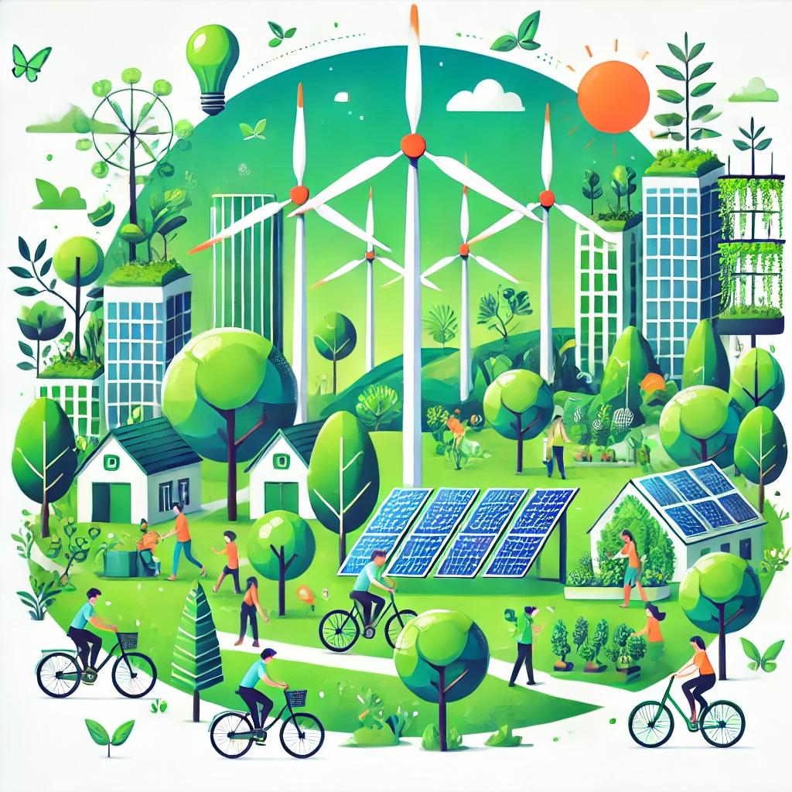

## La Economía Verde

La **economía verde** y la **economía circular** son conceptos complementarios enfocados en la sostenibilidad. La economía verde busca el crecimiento económico con un bajo impacto ambiental, promoviendo la reducción de emisiones, el uso eficiente de recursos y el desarrollo de energías limpias. Por otro lado, la economía circular propone un modelo de "reducir, reutilizar y reciclar", minimizando residuos y extendiendo la vida útil de los productos.

La economía verde se integra en la economía circular al compartir el objetivo de utilizar recursos de manera sostenible, reducir residuos y fomentar la innovación en tecnologías limpias. Mientras la economía verde establece los principios ambientales, la economía circular ofrece estrategias prácticas para alcanzarlos, contribuyendo así a un desarrollo más sostenible y bajo en carbono.

